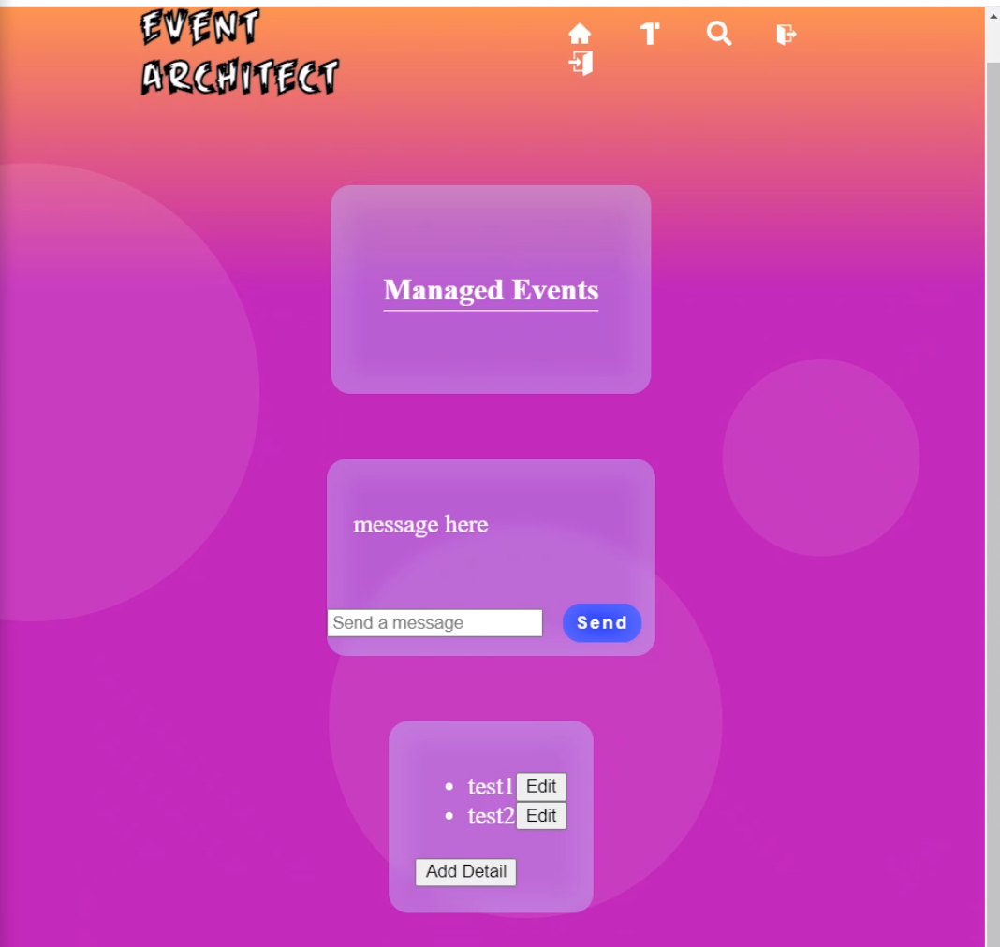
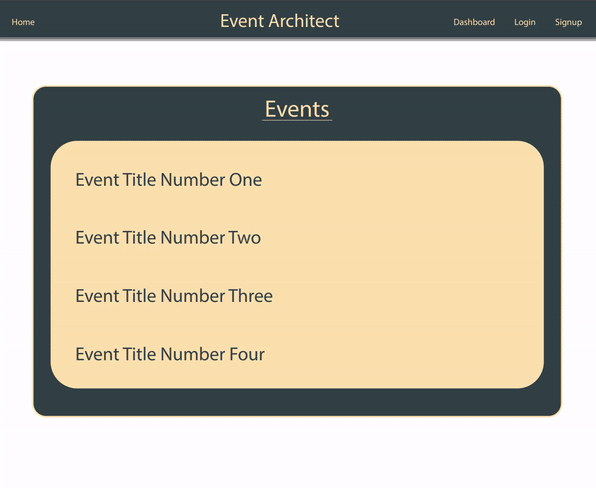
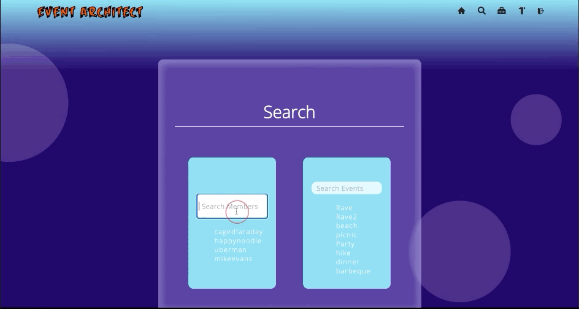

# Event Architect

## Bring your <em>best</em> Private Parties to Public Events!

[Open](https://dmartin4820.github.io/event-architect/) <strong>Event Architect</strong>:
<code>[https://dmartin4820.github.io/event-architect/](https://dmartin4820.github.io/event-architect/)</code>

<!--  -->

## Table of Contents

* [Installation](#installation)
* [Usage](#usage)
* [Credits](#credits)
* [License](#license)
* [Example case](#Example case)

## Installation

This app was designed and built to run in a basic Chrome browsing environment.

Simply point your browser to:
[https://dmartin4820.github.io/event-architect/](https://dmartin4820.github.io/event-architect/)     
1. Become a member
2. Begin planning
3. Invite friends
4. Organize together
5. *<strong>Party smart!</strong>*

## Usage 

* Event Architect leaps instantly to a new Member's aid by offering a live, local events feed from the API at TicketMaster.com.
* Following an event allows you to create a new party on your Member Dashboard.
* Invite attendees to the Event Planning Page adn they can join in adding details to help organize your party.
* Follow other Members and join them to organize future Event-going parties.  Your Member Dashboard stores all your Events, and all your contacts (Members you are following, and those who are following you).
* Read and post Details to the event pages you are following.
* Chat live with your Event Architect Contacts through your own private Socket.io channel!
* Acces all information quicky and easily with the aid of List.js functionality, including auto-complete, and elastic-serch.
* Log in and out of your Member Account for full access and functionality to all of your Event Architect Events through your Memeber Dashboard from any internet-enabled device anywhere.

## Example case:
### Surprise 🎂 Birthday Party at The Colliseum

<strong>Emma's birthday is coming up!!!</strong>

She <em>hates</em> birthdays AND surprises. So, a big surpirise party it is! She loves big rock shows, and I want to surprise her by having ten of our closest friends and family meet us in our seats at a local show.

<strong>Now to organize this <em>private party</em> at a <em>public event!</em></strong>

#### <strong>Event Architect</strong> to the rescue!
I point my browser to the [Event Architect](https://dmartin4820.github.io/event-architect/) website and make a login:

Now I need to find a local rock show for the weekend of my wife's birthday.  A quick query of the TicketMaster API reveals that Queen with Adam Lambert is playing at the Colliseum!  Her favorite band ever!!

I follow the event:

From my Member Dashboard, I can add the first detail cards to the event:
* Shhhhh Surprise Party!!
* date and time
* venue, tickets in will Call
* Park in the North Lot
* Enter from the North (we'll park and enter from the South Lot)
* Shhhhh <strong>SURPRISE</strong> Party!!!!

Search for friends:

Let's follow our friends, so they can view and contribute to our surprise party planning:

We can also privately chat live through Socket.io:

<strong>Surprise</strong> - no one leaked our secret plans!!! Let's see how it all came together on the Event Page by the Day of the show:

## Credits

<strong>Denzal Martin: </strong>[email](dom4822@yahoo.com.) | [portfolio](https://github.com/dmartin4820)
Concept, Design, Backend, HTML, JS, Socket.io, [List.js](https://listjs.com/) 

<strong>Troy Johnson: </strong>[email](tnj8510@gmail.com) | [portfolio]()
Concept, Design, Handlebars, HTML, JS, CSS, API and HTML routes

<strong>James Boblak: </strong>[email](james@skepticalrecords.com) | [portfolio](https://github.com/jamesboblak)
Concept, API and HTML routes, this readme.md

[Full Stack Developer Bootcamp](https://bootcamp.berkeley.edu/coding/)
UC Berkeley Extension, Summer 2021

ww3schools.com
developer.mozilla.org
YouTube.com

## License

[MIT](https://choosealicense.com/licenses/mit/)

### Developer Usage
1. Get your TicketMaster API key [here](https://developer.ticketmaster.com/)
2. Clone <strong>Event Architect</strong> from our [GitHub repository](https://github.com/dmartin4820/event-architect)
3. Inside your local directory:
<code>npm install</code>
4. If you need seed data:
<code>node run seed</code>
5. Launch <strong>Event Architect</strong>:
<code>node server.js</code>

## Badge

## Tests

Example testing scripts available upon request

---

 This good readme was created by [readme-generator](https://github.com/jamesboblak/readme-generator) :)